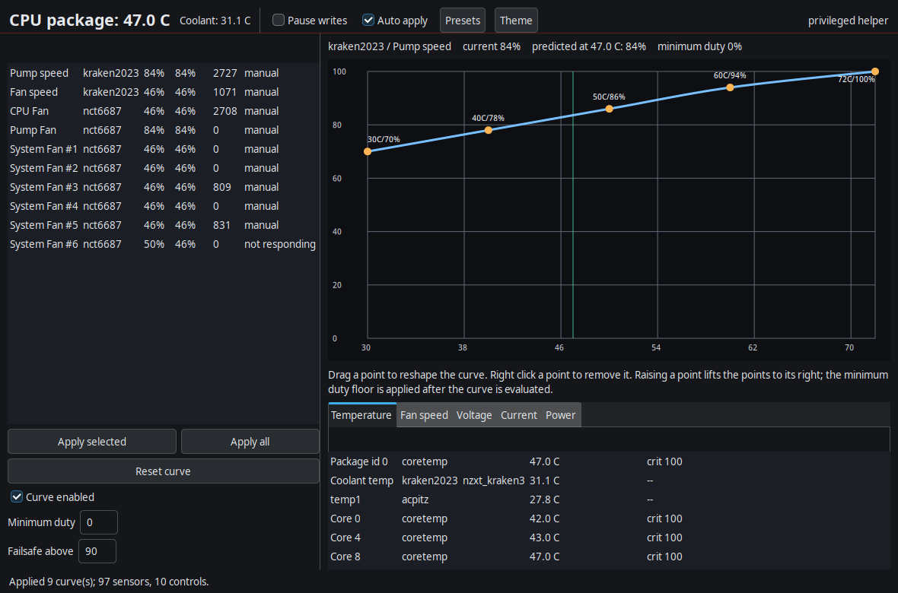

# liquidgui

`liquidgui` is a C11/GTK3 fan-control application for Linux. It reads the
sensors the kernel exposes under `/sys/class/hwmon`, drives AIO coolers and
motherboard fan headers from a shared curve editor, and refuses to leave your
fans in an unsafe state when it exits.

This repository is self-contained: C, a Makefile, and test data. There is no
Python in the build or the test suite. It replaces the earlier Python/Tk
implementation, which lives in a separate repository and is not vendored here —
see [Provenance](#provenance).



## What it controls

- **AIO coolers** exposed through hwmon, including the in-kernel
  `nzxt_kraken3` driver that backs the NZXT Kraken. The pump and fan become
  first-class controls alongside the motherboard headers.
- **Motherboard fan headers** exposed as writable `pwmN` nodes.
- **HID-only AIOs** via `liquidctl`, as a fallback when a cooler has no hwmon
  interface at all. Only used when the AIO is not already reachable through
  hwmon, so a single cooler is never driven through two paths at once.

## What it reads

Everything the kernel offers, not just temperatures and fan speeds:

| Class | Source |
|---|---|
| Temperature | `temp*_input` on every hwmon chip, plus `_min`/`_max`/`_crit` |
| Fan speed | `fan*_input` |
| Voltage | `in*_input` with `_min`/`_max` — VRM rails, DRAM, chipset, Vcore |
| Current | `in*_input` where a driver reports amperage |
| Power | `power/energy1_input` energy counters |
| Thresholds | `*_crit`, `*_max`, `*_min`, NVMe `*_alarm` |

**Dead channels are filtered rather than displayed.** An NCT6687 on this board
reports `PCIe x1` pinned at 193 °C and `Virtual 0` at −63 °C; those are
unconnected inputs parked on a driver-declared bound, and the old interface
rendered them as if they were real temperatures. A temperature equal to its
declared `*_min` is treated as unconnected. The same test is deliberately *not*
applied to voltages or fan speeds, where sitting at a declared minimum is
legitimate — an idle Vcore at 558 mV, or a fan that has stopped.

## Build

Requires GTK3 and a C11 compiler. On Arch: `pacman -S gtk3`.

```bash
make
sudo make install           # installs /usr/bin/liquidgui
sudo make install-helper    # installs the setuid helper and the udev rule
```

`PREFIX` defaults to `/usr`. To install elsewhere, for example under
`/usr/local`, pass `PREFIX=/usr/local` to both targets.

## Privileged writes

hwmon `pwm*` nodes are `root:root 0644`, so writing them needs root. Rather than
shelling out to `sudo` on every write, `make install-helper` installs a small
setuid helper:

```bash
sudo make install-helper
```

It accepts one request shape and refuses everything else:

```
lg-helper --set <pwm path> <0-255>
lg-helper --set <pwm path> --enable <pwm_enable path> <0-255>
```

The target must match `^/sys/class/hwmon/hwmon[0-9]+/pwm[0-9]+(_enable)?$` with
no traversal, opened with `O_NOFOLLOW` and checked with `fstat`. There is no
shell, no format string and no general write primitive.
`tests/test_helper_allowlist.c` exercises the validator against traversal,
symlink nesting, and malformed values.

If the helper is absent, `liquidgui` falls back to `pkexec` and then `sudo -n`,
and says so in the header.

## Usage

```bash
liquidgui                     # launch the interface
liquidgui --dump-detect       # discovered sensors and controls as JSON
liquidgui --dump-config       # resolved configuration, including migrations
liquidgui --no-apply          # start with automatic application off
liquidgui --screenshot out.png  # render the window to a PNG and exit
```

Shortcuts: `Ctrl+A` apply all, `Ctrl+a` apply selected, `Ctrl+R` reset the
selected curve, `Space` pause writes, `Ctrl+T` toggle theme.

## Safety

- **Minimum duty floor** per control, applied after the curve is evaluated, so
  a curve can never spin a fan below a chosen speed.
- **Stall detection** — a control commanded to at least 20 % that reports 0 rpm
  for three consecutive samples raises a banner.
- **Thermal failsafe** — above a configurable threshold every enabled control is
  held at 100 % and the banner turns critical.
- **Restore on exit** — `SIGINT`, `SIGTERM`, `SIGHUP` and window close stop the
  worker, return the fans to a safe state, and exit. The mode is configurable:
  full speed, hand back to the board's own curve, or leave as-is. `SIGKILL`
  cannot be caught and is the one case left to you.

  **Full speed is the default, not handback.** Handing back means writing
  `pwm_enable=2`. That is documented on `nct6687` as "the controller runs its
  own curve", but on `nzxt_kraken3` it was measured to zero both outputs: the
  radiator fan stopped dead and the pump was left coasting. The value that
  releases a channel to the firmware is not the value that releases it on every
  driver, and a stopped fan is a much worse outcome than an over-speed one, so
  the safe reading is the default and handback has to be chosen deliberately.

  When handback is selected, a control whose driver is not known to handle `2`
  safely is refused and left at full speed instead, per control. The test suite
  pins this: `nzxt_kraken3` controls must not be marked safe to hand back.

  Restoring is a single write per control with no readback verification and no
  retries. Verifying the result would gate the restore on a channel that will
  never accept a write, and retrying four times at 250 ms per attempt added
  seconds to every shutdown. A measured `SIGTERM` to full speed is now about
  0.3 s.

  Shutdown is ordered deliberately: the worker is stopped first, so it cannot
  re-apply a curve after the restore. An earlier version did the restore from
  inside a raw signal handler, which forked and allocated while the worker was
  live and silently left the fans pinned. Exit takes a few seconds, most of it
  draining an in-flight apply pass.
- **Write verification** — see below.

## Things the kernel will not tell you

Two findings from probing this machine are baked into the write path, because
both are silent failures that the previous implementation could not detect.

**Entering manual mode resets the PWM register.** On `nzxt_kraken3`, writes to
`pwmN` are *discarded* while `pwm_enable` is 0 — the write returns success and
nothing happens. Setting `pwm_enable=1` is therefore mandatory, but it resets
the register to a driver default: measured here, `pwm2` went to 0 and the
radiator fan stalled for about a second. The helper takes the enable write and
the duty write in a single invocation so the window stays at microseconds; the
old code issued two separate `sudo tee` forks, tens of milliseconds apart, on
every apply.

**A write can be accepted and discarded.** `nct6687`'s `store_pwm` takes an
exclusive lock on the EC's fan register set, gives up after a one second
timeout if the EC is mid-update, and then returns the byte count as if the write
had succeeded. Nothing in userspace can detect this from the return value — the
node has to be read back. `liquidgui` does, retries across roughly the window
the driver itself allows, and reports any channel that still will not move
rather than showing a duty the hardware is ignoring.

## Configuration

Curves live in `~/.config/liquidgui/config.json` (or `$XDG_CONFIG_HOME`), written
atomically.

**Keys are stable.** They are built from the driver identity and channel
number — `pwm:nct6687:3`, `pwm:nzxt_kraken3:1` — never from the absolute sysfs
path. The previous implementation keyed on `/sys/class/hwmon/hwmonN/...`, and
`hwmonN` is assigned in probe order and changes between boots, so saved curves
could land on a different header or disappear. Where a board carries two chips
that report the same hwmon name (an `nct6683` alongside an `nct6687` here), the
platform driver name distinguishes them.

On first run, keys in the old format are migrated. An entry is only remapped
when the path still resolves *or* the old hwmon directory still exposes a
writable pwm at that channel. Anything else is reported as an orphan rather
than guessed at: matching on channel alone would hand an SPD5118 DIMM hub's
saved curve to the CPU fan, because the hub has no pwm at all but does have
numbered files. Curves that cannot be placed are listed in the load report so
you can re-apply them deliberately.

## Testing

```bash
make test           # unit, parity and migration tests
make check-parity   # diff discovery against the pre-rewrite golden file
make sanitize       # the same tests under ASan and UBSan
```

`tests/golden/` was captured from the Python implementation *before* the
rewrite. `test_curve_parity` compares the full float Bezier sample table and 241
duty lookups for each of 28 curves, so the C evaluation is held to the shipped
behaviour rather than to a reimplementation of it. Two details make that
possible: `lg_py_round` reproduces Python's round-half-to-even (C's `round` is
half-away-from-zero and would differ by a whole duty step), and the Bezier
control points are held in `double` because the tangent offsets are fractional.

`make check-parity` runs the same discovery assertions on their own.

The discovery differences from the previous implementation are intended, and are
asserted rather than merely reviewed: stable keys with no sysfs path, the AIO
surfaced through hwmon and never through two paths at once, dead channels
filtered, voltages newly read, and the read-only secondary Super-I/O excluded
from the control list. Hardware-specific expectations are only asserted when
that hardware is present, so the suite stays green on a machine with no fan
headers.

## Board support

Tested on:

- Manufacturer: `Micro-Star International Co., Ltd.`
- Product Name: `MPG Z790 CARBON WIFI (MS-7D89)`
- Super-I/O: `nct6687` (writable headers) and `nct6683` (monitoring only), via
  the DKMS driver in `/usr/src/nct6687d`
- AIO: NZXT Kraken 2023 via the in-kernel `nzxt_kraken3` driver

For Nuvoton NCT6687/NCT6687D boards see
[`akadata/nct6687d`](https://github.com/akadata/nct6687d).

## Links

- <https://articles.akadata.co.uk>
- <https://www.akadata.co.uk/>
- <https://www.breatechtechnology.co.uk/>
- <https://saphira.vm2.uk>

Saphira is our own Linux distribution, with Saphira-D providing the
systemd-based flavour. It deliberately remains non-usr-merged and supports
swapping between OpenRC and systemd while retaining the ability to boot back
into OpenRC should you wish.

## Licence

MIT. See `LICENSE`.

## Provenance

`tests/golden/` was captured from the previous Python implementation before this
rewrite began, and is the contract the C code is held to. The generator script
is not vendored here because it needs the Python tree; it lives alongside the
old implementation. To regenerate the goldens, check that repository out beside
this one and run its generator against this tree.

The golden files themselves are JSON fixtures, not Python, and are committed so
that `make test` is self-contained.
